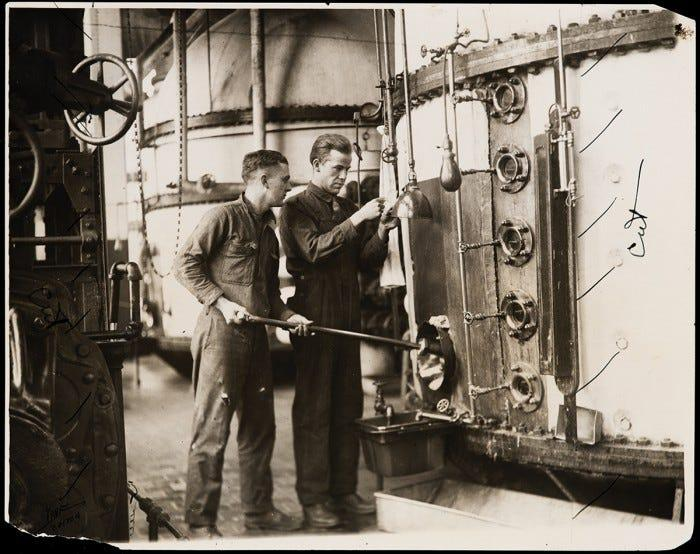

import imageBrettCornick from '@/images/brett-portrait-with-background.jpg'

export const article = {
  date: '2023-10-03',
  title: 'The William Walker model of deep tech VC',
  description: 'Week 2 of post series, "My Favorite Thing I Learned Last Week"',
  author: {
    name: 'Brett Cornick',
    role: 'Short-form',
    image: { src: imageBrettCornick },
  },
}

export const metadata = {
  title: article.title,
  description: article.description,
}

### Week 2 of post series, "My Favorite Thing I Learned Last Week"

Y Combinator (YC) has become synonymous with Silicon Valley success and the YC model has become the de-facto model for incubating early stage software companies.

❓So why has this approach NOT led to the same level of success for deep tech VC's?

[Eric Gilliam](https://www.linkedin.com/in/eric-gilliam-068b78116/) explores this problem in detail through a recent piece on his FreakTakes blog.

### 🔎 First, the root causes:

- YC's early goals were to enable founders to experiment quickly and establish proof-of-growth. For software startups, a sum of money and an introduction to a well-connected network was usually enough to achieve these. The same is not the case for deep tech, where MANY rounds of experimentation and proof-of-product-market-fit are more essential.
- The technical risks of software startups are practically negligible compared to those in the hard sciences, where products must progress through 9 Technology Readiness Levels (TRLs) before de-risking.
- Software is (relatively) easy to scale compared to deep tech, so long as the potential market is large enough.

📜 So how was technology funded and commercialized in the early to mid 1900s when ALL tech was deep tech? In general the most successful orgs had three things in common:

- A pool of talented researchers excited to work on interesting and applied problems
- A system of exposing their researchers to profitable, real-world problems
- Effective pairing of researchers to short-term problems they were well-equipped to solve

### 💡 The key insight from these historical examples?

Technical founders can be enabled to continuously experiment and find product-market-fit (the two key requirements for deep tech startups mentioned above) by engaging in research contracts brought to them by real industry players. Even if these contracts only "break even", the experience gained and insights learned about real industry problems enable researchers to spin-out more generalized solutions without needing to fully bootstrap exploratory R&D.

💎 Eric proposes the "William Walker model" for deep tech VC, pulling inspiration from mid 1900s success while leveraging the resources and learnings of modern risk capital. An org established in this model would have:

- A small team of full-time researchers engaged in one specific area of research consulting
- A research head that has experience sourcing and working on industry contracts
- Access to capital that is willing to invest in the spin-outs of the research staff
- A risk model that assumes fewer "unicorns" but more "solid growth" ventures throughout its time horizon

While this model is a substantial shift from the status quo, you can already see many deep tech VCs moving in this direction as they adopt and grow "Founder in Residence" programs.

Read Eric's original very well-written piece [here](https://www.freaktakes.com/p/an-alternative-approach-to-deep-tech).
