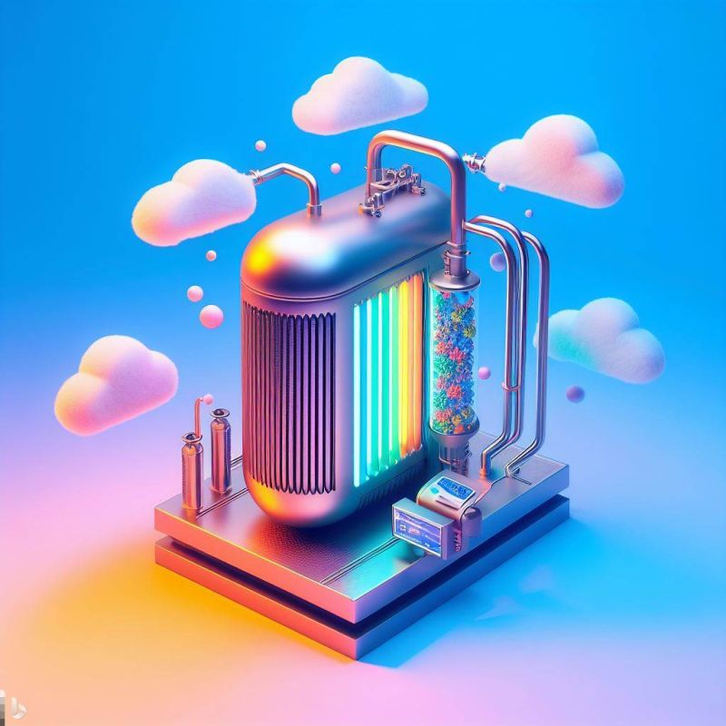

import imageBrettCornick from '@/images/brett-portrait-with-background.jpg'

export const article = {
  date: '2023-10-17',
  title: 'Cryogenic direct air capture of carbon dioxide',
  description: 'Week 4 of post series, "My Favorite Thing I Learned Last Week"',
  author: {
    name: 'Brett Cornick',
    role: 'Short-form',
    image: { src: imageBrettCornick },
  },
}

export const metadata = {
  title: article.title,
  description: article.description,
}

### Week 4 of post series, "My Favorite Thing I Learned Last Week"

Microsoft is venturing into a novel territory by filing a patent for a "cryogenic direct air capture" system that essentially aims to freeze carbon solid from the atmosphere.

### ⚙️ How it works:

- Air is drawn into a "recuperative heat exchanger" which cools it down to just above the carbon dioxide's "deposition point."
- This cold air is then exposed to a "deposition surface" cooled by a cryogenic refrigerator, turning CO2 into solid, which is then collected.
- Remaining air is released back, initiating the cycle once more.

### 💬 Microsoft's stance:

- They emphasize the urgency of capturing atmospheric carbon to mitigate climate change impacts.
- Current "direct air capture" methods are expensive and energy-intensive.
- Their goal: Become carbon-negative by 2030 & neutralize their historical carbon footprint by 2050.

### 🤔 Expert take:

- Dr. Dan Stein of Giving Green believes the idea is plausible in theory but wonders about its practical application and energy consumption.

### 📕 Some context:

- Carbon removal is a challenge: Expensive, tough to scale, and potentially requiring vast amounts of land or resources.
- Big Tech, including Microsoft, acknowledges that merely reducing emissions isn't enough. The future lies in viable carbon removal techniques.
- Progress in the fight against climate change needs innovative approaches like this, but can this approach be scaled efficiently?

### ➡️ Side note:

As a part of my project in my Stochastic Studio course, I've set up an automation pipeline for myself that polls for newly published patents matching certain keywords and then uses GPT-4 to summarize the results. It was pretty satisfying for that pipeline to give me this gem on its first time running!

### Sources:

https://www.microsoft.com/en-us/research/project/carbon-capture-and-storage/
https://www.fool.com/investing/2023/10/12/microsoft-fights-climate-change-with-cryogenics/
https://medium.com/@markelitics2022/microsofts-cryogenic-carbon-capture-b594de5999a6

Image created by DALL-E 3
