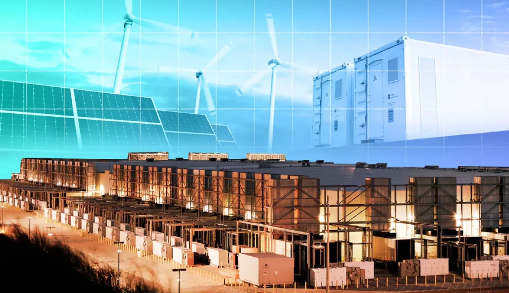

import imageBrettCornick from '@/images/brett-portrait-with-background.jpg'

export const article = {
  date: '2026-03-02',
  title: 'Curtailment-aware workload scheduling for multi-agent energy systems',
  description:
    'We trained an LLM on electricity the grid couldn&apos;t use. The same scheduling approach could train the AI that coordinates the grid itself.',
  author: {
    name: 'Brett Cornick',
    role: 'Blog post',
    image: { src: imageBrettCornick },
  },
}

export const metadata = {
  title: article.title,
  description: article.description,
}

In 2024, California discarded <a href="https://www.eia.gov/todayinenergy/detail.php?id=65364" target="_blank" rel="noreferrer">3.4 million megawatt-hours</a> of clean electricity. That&apos;s enough to power roughly 300,000 homes for a year. This wasn&apos;t a failure of generation, but a failure of absorption: the grid couldn&apos;t use the power, so it was curtailed. The problem is also growing. That figure was up 29% from the previous year, and similar patterns are emerging in Texas, South Australia, and parts of Europe as renewable capacity outpaces grid infrastructure.

Curtailed energy is clean and, in many markets, effectively free. This raises a question for the opportunistic: what if compute-intensive AI workloads could absorb this surplus and minimize the need for new transmission infrastructure?

I recently collaborated with the expert team at <a href="https://www.exalsius.ai" target="_blank" rel="noreferrer">exalsius</a> to demonstrate a system that does exactly this. We trained a 561-million-parameter language model across GPU clusters in three regions, activating training only during curtailment windows identified from real-time marginal carbon intensity data. The system elastically switches between local single-site training and federated multi-site synchronization as clusters become available or go offline. The result: training quality comparable to a conventional single-site run, at only 5-12% of the carbon emissions. That paper is available <a href="https://arxiv.org/abs/2602.22760" target="_blank" rel="noreferrer">on arXiv</a> and the code is <a href="https://github.com/exalsius/curtail-llm" target="_blank" rel="noreferrer">on GitHub</a>.

Now, how might this same training architecture apply towards a different class of AI workload, one that&apos;s directly relevant to managing the grid itself? That&apos;s the question that I address in this piece.

## Why multi-agent reinforcement learning matters for the grid

The electricity grid is changing shape. For a century, power flowed one way: from a few large generators, through transmission and distribution networks, to consumers. The coordination problem was hard but centralized. A relatively small number of dispatchable plants needed to match demand in real time.

That model is breaking down. The grid increasingly depends on thousands of small, distributed energy resources: rooftop solar panels, home batteries, electric vehicle chargers, heat pumps, and flexible industrial loads. These resources are individually small but collectively significant. The challenge is coordination: deciding when each device should charge, discharge, consume, or curtail to balance supply and demand across the system while respecting grid constraints, market signals, and the preferences of individual device owners. A collection of such resources operating in coordination with one another is called a virtual power plant (VPP).

The classical approach to this resource optimization problem is model predictive control (MPC): formulate an optimization problem, solve it centrally, dispatch the result. MPC works well for small, homogeneous portfolios. But as the number and diversity of devices grow into the thousands, the optimization becomes increasingly expensive to solve, difficult to adapt to new device types, and dependent on centralizing data that device owners may not want to share. <a href="https://arxiv.org/abs/2404.15583" target="_blank" rel="noreferrer">A recent survey</a> of computational challenges in energy network management identifies scalability, decentralization, and handling heterogeneous participants as key open problems that classical approaches struggle to address.

Reinforcement learning offers a different approach. Instead of solving an explicit optimization problem at each timestep, an RL agent learns a policy (a mapping from observations to actions) through repeated interaction with a simulated environment. The agent discovers strategies by trial and error, guided by a reward signal. Multi-agent reinforcement learning (MARL) extends this to many agents learning simultaneously, each controlling a different resource but needing to coordinate with the others. The appeal for energy systems is that MARL agents can learn coordination strategies that are difficult to hand-engineer, adapt to changing conditions without retraining from scratch, and scale to large populations of heterogeneous devices. Recent work has demonstrated this concretely: <a href="https://www.sciencedirect.com/science/article/pii/S030626192400196X" target="_blank" rel="noreferrer">Li et al. (2024)</a> show that MARL agents can autonomously generate energy bidding and management strategies for community VPPs without requiring access to other participants&apos; private information.

The primary challenge is that MARL training can also be computationally expensive. Training thousands of agents across realistic grid simulations requires sustained GPU time, often days or weeks. Recent work on parameter-efficient MARL methods helps reduce this cost but doesn&apos;t eliminate it. <a href="https://arxiv.org/abs/2502.05573" target="_blank" rel="noreferrer">LoRASA</a> (Low-Rank Agent-Specific Adaptation), for example, appends small, low-rank adaptation layers to a shared policy backbone, allowing each agent to specialize without maintaining a fully independent network. The approach reduces parameter counts substantially, but training still requires iterating over large agent populations across many environment steps. In energy applications, the simulated environments themselves (realistic grid models with power flow calculations, market dynamics, and device physics) add computational weight to each step. Adapting these policies to new device portfolios or changing grid conditions means periodic retraining, making this a recurring rather than one-off compute cost.

Here, the connection to our curtailment paper becomes clear. MARL training for energy systems shares the properties that make LLM pretraining a good fit for curtailment-aware scheduling: it&apos;s delay-tolerant, it can be checkpointed and resumed, and it can be distributed across sites. A LoRASA-style architecture is a particularly natural fit. The shared backbone can be synchronized across federated sites while agent-specific adapters train locally and intermittently, mirroring the privacy-preserving structure our system inherently supports.

## The architectural bridge

The federated learning system we demonstrated for LLM pretraining maps structurally onto how MARL agents for energy systems would need to train. The parallels are specific enough to be worth spelling out.

**Geographic distribution.** Our system trains across GPU clusters in California, Texas, and South Australia, coordinating via federated averaging. Each site trains locally, and a central coordinator periodically aggregates the resulting model updates. MARL for energy systems faces the same topology. Agents control devices spread across different grid regions, potentially trained on local data that can&apos;t be centralized due to privacy constraints or regulatory boundaries. The elastic federation architecture described in our paper, where sites join and leave as curtailment windows open and close, is directly analogous to how a federated MARL system would need to handle intermittent participation from distributed training sites.

**Privacy-preserving coordination.** In our paper&apos;s system, each site trains locally and shares only model weight updates, never raw data. This is exactly the property that energy system operators need. Residential battery data, EV charging patterns, and household consumption profiles are sensitive. A federated MARL architecture would allow agents to learn coordinated behavior without exposing individual customer data to a central server. This approach is already showing results in <a href="https://www.sciencedirect.com/science/article/abs/pii/S0952197624017378" target="_blank" rel="noreferrer">federated RL for residential microgrid clusters</a>, where privacy-preserving training achieves competitive performance without centralizing household data. Our paper demonstrates that federated training works mechanically at the systems level: the scheduling, provisioning, and aggregation infrastructure holds up under intermittent availability. The open question is whether the same approach preserves learning quality for multi-agent policies, where coordination between agents is the whole point.

**Elastic participation.** Our paper&apos;s system handles sites appearing and disappearing mid-round, weighting aggregation by work performed rather than assuming a fixed number of participants. For energy MARL, this maps to a practical deployment constraint: not all training sites will be available at all times, especially if training is itself scheduled around grid conditions. The hysteresis mechanism we use (waiting a configurable period before provisioning or deprovisioning to avoid oscillation from transient signal changes) is a systems-level detail that transfers directly to any geo-distributed training workload.

It&apos;s also worth being clear about what doesn&apos;t transfer cleanly. LLM pretraining is a single-model optimization problem. MARL involves multiple interacting policies, where the behavior of each agent depends on what the others are doing. Federated averaging over agent populations raises coordination questions that don&apos;t arise in language modeling:

- _Does local training divergence disrupt learned cooperation?_
- _How does aggregation frequency affect emergent multi-agent strategies?_

While more exploratory work is needed to answer these MARL-specific questions, the systems infrastructure is the same.

## A closed loop

There&apos;s something circular about this picture, in a productive way.

GPU clusters that train energy-optimization AI can themselves participate in grid flexibility. A GPU cluster that curtails its compute load during grid stress and ramps up during renewable surplus is acting as a demand-response resource, precisely the kind of distributed energy resource that the MARL agents are learning to coordinate. The training infrastructure and the problem domain collapse into the same system.

To make this concrete: a GPU cluster located near a region with high renewable penetration trains MARL agents during periods of excess generation. When the surplus drops, the cluster curtails its load, freeing capacity for the grid. The agents it trains will eventually coordinate thousands of similar flexible resources (batteries, EVs, heat pumps) to do the same thing at household and commercial scale. The cluster is simultaneously a training platform and a participant in the system being optimized.

Data center flexibility is not entirely new. <a href="https://www.latitudemedia.com/news/google-expands-demand-response-to-target-machine-learning-workloads/" target="_blank" rel="noreferrer">Google recently announced</a> agreements with utilities to shift ML training workloads during grid stress events, marking the first time AI compute has been incorporated into utility demand response programs. And <a href="https://rmi.org/fast-flexible-solutions-for-data-centers/" target="_blank" rel="noreferrer">RMI estimates</a> that curtailing just 0.5% of annual operating hours could unlock nearly 100 GW of new data center capacity without expanding generation infrastructure.

But for large hyperscale operators, the economics of flexibility are unattractive. GPUs that cost $25,000-40,000 each depreciate over three to five years whether they&apos;re running or not. Every idle hour is lost revenue against hardware that is losing value regardless. Hyperscale facilities are optimized for sustained high utilization, and voluntarily curtailing that utilization, even briefly, runs against the financial logic they&apos;re built on.

Smaller, geo-distributed clusters face a different calculus. A cluster purpose-built for delay-tolerant workloads near cheap renewable generation doesn&apos;t need 90%+ utilization to justify its existence. It can be designed from the start to flex with the grid, accepting lower average utilization in exchange for access to low-cost or free curtailed energy. Our curtailment paper demonstrates the scheduling mechanism that makes this work. What&apos;s still missing is the application to energy-specific AI workloads rather than general-purpose language models.

## What&apos;s still missing

Three open questions are worth stating plainly.

First, federated averaging works well for a single model being trained across sites. Whether it works as cleanly for populations of interacting agents, where coordination between policies is the objective, is an open research question. Our paper demonstrates the plumbing. The learning dynamics for MARL may impose different constraints on round duration, aggregation strategy, or how much local training can diverge before synchronization.

Second, curtailment windows are unpredictable. Our system handles this reactively, but MARL training may be more sensitive to interruption than LLM pretraining. If an agent population is mid-convergence on a coordination strategy and a subset of training sites drop out, does the remaining training destabilize? This needs empirical investigation.

Third, we use marginal carbon intensity as a proxy for curtailment. For operational deployment, tighter integration with grid operator signals, real-time electricity pricing, or co-located renewable generation would make the scheduling signal more reliable and the emissions accounting more auditable.

_In case you hadn&apos;t guessed by now, this is an early preview into my PhD thesis and venture creation work._

## Closing

Our curtailment paper solves a systems problem: how to orchestrate elastic, geo-distributed training under intermittent resource availability. That problem doesn&apos;t belong to language models. It belongs to any large-scale training workload that can tolerate flexible scheduling.

Multi-agent reinforcement learning for energy systems is a natural next application, and the architectural fit is closer than most: federated, privacy-constrained, geographically distributed, and running on infrastructure that is itself part of the energy system it optimizes. The components exist, the scheduling works, and the application domain is waiting. The interesting work is in connecting them.

---

_Cover photo by <a href='https://www.canarymedia.com/articles/utilities/how-to-build-data-centers-without-raising-grid-costs-and-emissions' target='_blank' rel="noreferrer">Binh Nguyen</a> for Canary Media._
_This article was originally <a href="https://medium.com/@brett.cornick/curtailment-aware-workload-scheduling-for-multi-agent-energy-systems-884a45f8c813" target="_blank" rel="noreferrer">posted on Medium</a>._
