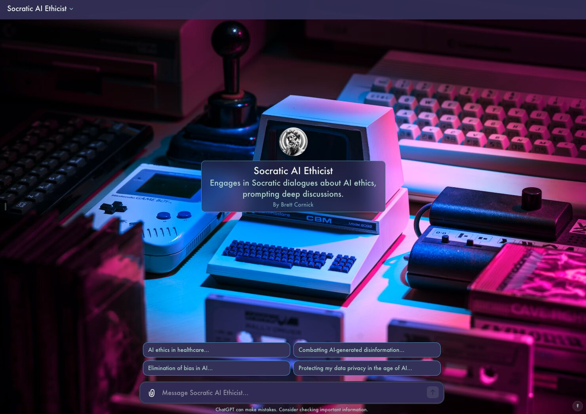

import imageBrettCornick from '@/images/brett-portrait-with-background.jpg'

export const article = {
  date: '2023-11-14',
  title: 'Exploring Custom GPTs',
  description: 'Week 8 of post series, "My Favorite Thing I Learned Last Week"',
  author: {
    name: 'Brett Cornick',
    role: 'Short-form',
    image: { src: imageBrettCornick },
  },
}

export const metadata = {
  title: article.title,
  description: article.description,
}

### Week 8 of post series, "My Favorite Thing I Learned Last Week"

I'm changing the format up this week (and I also missed week 7 😬) because I have been completely enthralled with building and testing new custom GPTs, which OpenAI released last week.

I'll spare you the "what are they" description since every tech influencer from here to the moon has already covered that, and instead I'll jump into how I'm personally using them to automate some common deep-tech entrepreneurial workflows (without writing a line of code).

Over the past few months, I have been extensively using Make (a Zapier alternative) to build automations for myself that can be managed and controlled through a Notion dashboard that I set up. For example, I've created automations that can help with LinkedIn outreach, grant proposal preparation, patent drafting, freedom-to-operate analyses, and several more. These have been great for me, but the way that they are currently built is not amenable to sharing with others (mostly due to complexity in set-up and authentication).

Replacing Notion with a new custom GPT allows me to abstract away those challenges, while also adding some great additional capabilities.

The key new functionality is the introduction of external "actions" to custom GPTs. Through an action, I can now instruct my GPT to call a webhook that can trigger any Make (or Zapier) automation and send back a response that can be used to continue the conversation. On top of that, the custom GPT can be shared with anyone through a URL (or even monetized on the forthcoming GPT store).

I can't overstate how INSANELY powerful this. Wildly complex custom chains of API calls can now be triggered through the ChatGPT interface, and you don't need any coding experience to do it (though you should at least understand JSON syntax and API request basics). The only real limit here is your own creativity.

So now I'm working on integrating my Make automations into my own Deep-Tech Entrepreneurial copilot. I'll make that available to anyone interested in the coming weeks.

In the meantime, enjoy a Socratic dialogue on AI ethics with [this custom GPT](https://chat.openai.com/g/g-XOUpwElnT-socratic-ai-ethicist) that I set up in ~5 minutes.

And if you want your ChatGPT to look like the image in the post, try out [this Boost](https://arc.net/boost/63728A89-D13F-4E43-AEF2-FB28CFC45A73) I made in the Arc browser.
