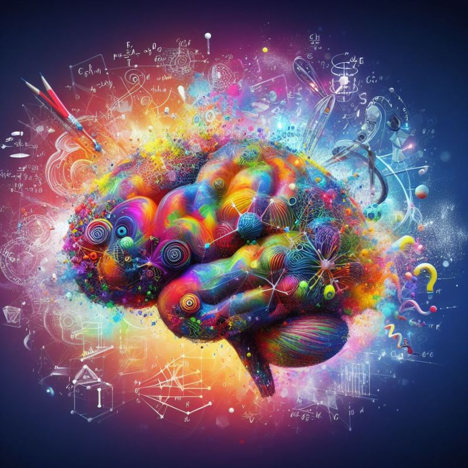

import imageBrettCornick from '@/images/brett-portrait-with-background.jpg'

export const article = {
  date: '2023-10-31',
  title: 'Mathematical definitions of creativity',
  description: 'Week 6 of post series, "My Favorite Thing I Learned Last Week"',
  author: {
    name: 'Brett Cornick',
    role: 'Short-form',
    image: { src: imageBrettCornick },
  },
}

export const metadata = {
  title: article.title,
  description: article.description,
}

### Week 6 of post series, "My Favorite Thing I Learned Last Week"

Is it possible to quantify creativity, or at the very least, derive an “equation” that can describe it? And how does creativity manifest itself in scientific research vs artistic expression? Defining and understanding creativity can be subjective and inexact, but a few recent readings helped me to explore the subject and led me to ask a few questions that I hadn't previously considered.

### 🔀 The combinatorial nature of creativity

Eminent figures like Albert Einstein and various psychologists have suggested that creativity ultimately entails a combinatorial process - forming associative elements into new combinations that meet specific requirements or provide a useful result. To adapt this in a more granular and instructive way, Simonton (2021) argues that scientific creativity can be defined using three combinatorial parameters: initial probability p, final utility u, and a scientist's prior knowledge of that utility v. Creativity can then be mathematically formulated as c=(1-p)u(1-v).

By this definition, creativity becomes the product of originality, utility, and surprise.

### 🤔 What's the point?

This combinatorial theory of creativity has critical science implications, like providing a solid foundation for effective education and scientific discourse. Highly relevant to the technology of today, direct application of these models can also aid in the development of AI agents that can accurately mimic human behavior.

This is the part that I find most interesting, since even seemingly counterproductive activities, like mind wandering or daydreaming, can play crucial roles in increasing chances of serendipitous discoveries and nurturing creativity. Prominent artists and scientists alike have also argued that a "state of solitude" can be essential to the creative process, where one can be unbothered by people's opinions and is creatively attuned to the nascent ideas & vague questions arising within them.

So can we improve AI model performance by perfecting the ability for AI to "daydream", or is this a uniquely human activity? Can there be an analogue for "solitude" in an AI model that cares not of people's opinions and is trained on the entirety of written human knowledge?

Surprisingly, these ideas are far from novel. Mueller and Dyer (1985) discussed a computational theory of human daydreaming almost 40 years ago!

Using a mathematical equation to define creativity may seem like an over-simplification (or even an over-complication depending on your point of view), but it does provide another lens through which we can examine what creativity truly entails and how it fundamentally affects everything that we do.

I guess I've asked more questions this week than I've answered, but I've thoroughly enjoyed where those questions have taken me.

### Sources:

https://www.frontiersin.org/articles/10.3389/fpsyg.2021.721104/full
https://www.henrikkarlsson.xyz/p/good-ideas
https://mf.media.mit.edu/courses/2006/mas845/readings/files/muellerErik_daydreaming.htm

Image created by DALL-E 3
