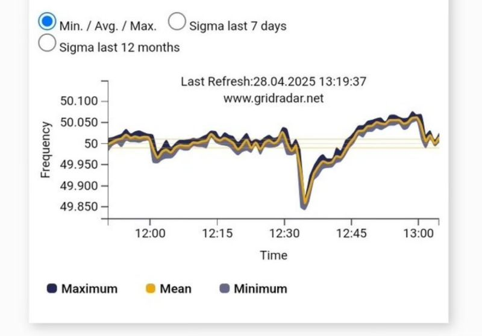

import imageBrettCornick from '@/images/brett-portrait-with-background.jpg'

export const article = {
  date: '2025-05-01',
  title: 'How to avoid another Iberian blackout',
  description:
    "This week's widespread blackouts across Europe demonstrate the urgency with which we need to be modernizing our power grid systems.",
  author: {
    name: 'Brett Cornick',
    role: 'Short-form',
    image: { src: imageBrettCornick },
  },
}

export const metadata = {
  title: article.title,
  description: article.description,
}

🪫 <strong>This week's widespread blackouts across Spain, France, and Portugal demonstrate the urgency with which we need to be modernizing our power grid systems.</strong>

The power outages highlight a critical challenge: modern grids need dynamic solutions to stabilize frequency as renewables penetration grows → the image below shows how a power frequency deviation was a primary factor in the lead up to Europe's blackouts.

Let me explore briefly how a modernized AI-assisted Virtual Power Plant (VPPs) could have mitigated these disruptions.

### ⚡️ Grid Inertia and Renewable Integration

Put simply, traditional grids rely on the inertia of fossil-fueled turbines to buffer frequency swings. As renewables replace thermal plants (which is undeniably a <em>good thing</em>), this stability cushion diminishes. VPPs, which aggregate distributed energy resources (DERs) like batteries, solar, and flexible loads, can provide synthetic inertia by rapidly adjusting supply and demand.

### 🔋 How could VPPs have helped today?

An AI-enhanced VPP can coordinate DERs and industrial loads (e.g., data center GPUs) to act as a unified grid stabilizer. Key actions during a blackout could include:

<strong>- AI-driven load shifting:</strong> predictive algorithms reroute power or
throttle non-essential workloads in milliseconds, aligning demand with renewable
generation

<strong>- GPUs as grid allies:</strong> high-power compute clusters can modulate
energy use faster than traditional plants, providing sub-second demand response

<strong>- Battery networks:</strong> distributed storage systems discharge during
voltage dips, bridging gaps until renewables stabilize

### 🔌 GPUs as flexible loads

While data centers are often criticized for energy demand (a problem that I am not dismissing here), studies show they can curtail 10% of their load within 5 minutes by shifting compute tasks. During today’s blackout, this type of flexibility among industrial energy consumers could have potentially freed gigawatts without disrupting critical services.

### ❓How can we move in the right direction?

- Policies and funding must incentivize “grid-responsive” infrastructure

- Industrial energy consumers should be incentivized to become energy prosumers through credits and streamlined energy trading processes

- It needs to become exceptionally easy for residential consumers to participate in VPPs with their own electrified home appliances

Regulators should further incentivize “grid-friendly” data centers and industrial consumers. Imagine if this week's blackout triggered a policy shift where:

- Data centers earn credits for offering load flexibility

- Utilities partner with tech firms to co-design VPP architectures

### 🔑 Key learning

Our current grid infrastructure and policies are built for out-of-date fossil-fuel energy generation and need to be modernized to keep pace with the rapid development and deployment of renewables.
