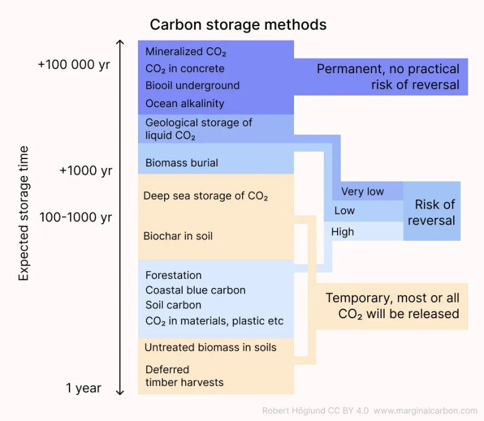

import imageBrettCornick from '@/images/brett-portrait-with-background.jpg'

export const article = {
  date: '2023-11-21',
  title:
    'Is permanence really the most important factor when evaluating carbon removal projects?',
  description: 'Week 9 of post series, "My Favorite Thing I Learned Last Week"',
  author: {
    name: 'Brett Cornick',
    role: 'Short-form',
    image: { src: imageBrettCornick },
  },
}

export const metadata = {
  title: article.title,
  description: article.description,
}

### Week 9 of post series, "My Favorite Thing I Learned Last Week"

In the global mission to reach net-zero, carbon offsetting has established itself as a crucial tool in our ever-growing (but still not big enough) toolkit.
However, defining, quantifying, and ensuring the 'permanence' of carbon removal efforts has added significant complexity and created what many consider a false-binary in the carbon offset market.

### So what is carbon permanence?

Permanence in carbon offsetting refers to the predicted duration that carbon removed will stay out of the atmosphere. It's an important factor in determining the efficacy and credibility of carbon offset projects. At first glance, a permanent solution appears superior to a temporary one (as argued by Bill Gates during Climate Tech Week in NYC). However, there is a growing contrarian perspective: should permanence really be held above all other criteria when evaluating projects? What about cost, scale, speed, and other factors?

### Examples of permanent and impermanent carbon removal

In general, bio-based carbon removal projects (like planting lots of trees) are impermanent carbon removal. Eventually the trees will die and the carbon will be returned to the atmosphere via respiration, combustion, and decomposition (this is called the 'short carbon cycle').
Newer technology-driven solutions like direct air capture achieve permanent carbon removal by returning the carbon to the 'long carbon cycle' (the process that naturally forms coal and oil). This is done by removing carbon from the atmosphere and storing it deep underground in saline formations or oil reservoirs.

### The importance of nuance and not "missing the forest for the trees"

Unfortunately, the prioritization of permanent carbon removal has shifted focus away from the sizable impacts that impermanent bio-based solutions can achieve. The creation of this false binary also discounts some key nuance in evaluating projects. For instance, many bio-based solutions provide ancillary benefits like soil remediation, increased bio-diversity, local temperature reductions, surface albedo, and (let's not forget) natural beauty! These projects are effective too, and a 2022 study by Matthews et al. claims that nature-based carbon removal can help lower peak warming to a well-below 2 °C scenario.

### A new type of eco credit?

Current carbon markets don't capture and value the ancillary benefits of impermanent solutions well, but there are some emerging projects in the web3 space working to tokenize more abstract metrics of climate progress (like biodiversity, methane removal, etc). Packaging these tokens into more 'holistic' credits may make it easier to directly compare permanent vs impermanent carbon removal solutions.

💬 What do you think?

### Sources:

https://www.nature.com/articles/s43247-022-00391-z
https://www.nature.com/articles/s41558-023-01815-0#Sec3
https://workweek.com/2023/10/12/the-false-binary-in-carbon-markets/

Image: https://marginalcarbon.substack.com/p/are-temporary-and-permanent-carbon
