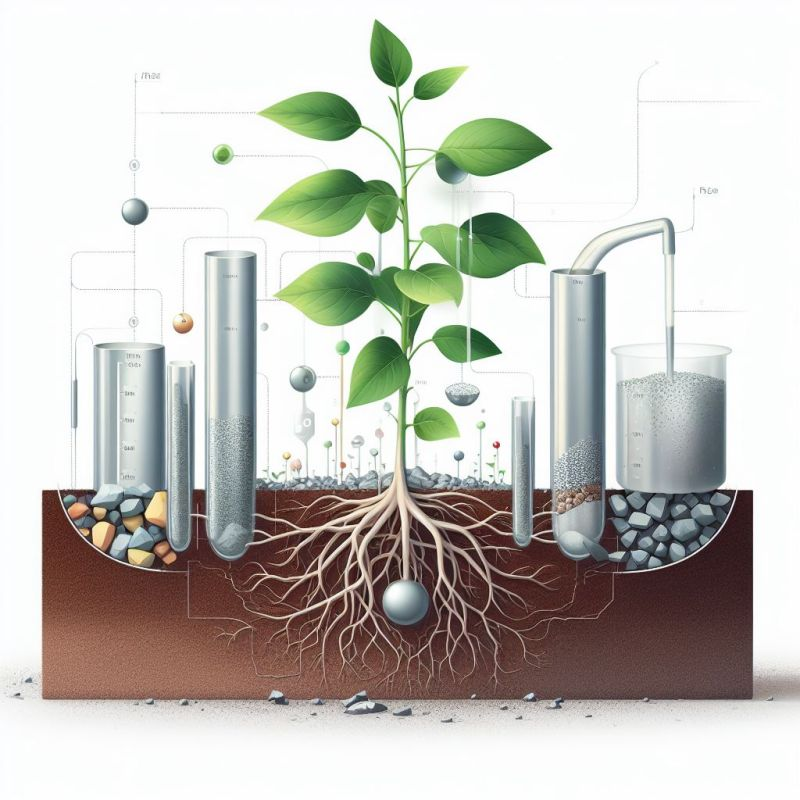

import imageBrettCornick from '@/images/brett-portrait-with-background.jpg'

export const article = {
  date: '2023-10-10',
  title: 'Phytomining for sustainable metal extraction',
  description: 'Week 3 of post series, "My Favorite Thing I Learned Last Week"',
  author: {
    name: 'Brett Cornick',
    role: 'Short-form',
    image: { src: imageBrettCornick },
  },
}

export const metadata = {
  title: article.title,
  description: article.description,
}

### Week 3 of post series, "My Favorite Thing I Learned Last Week"

⛏ When you think of the mining industry, lush green fields are probably not the first thing that come to mind. Enter phytomining, the process of using plants to extract metal compounds from ground soil, which might flip that traditional perception of mining on its head.

### 🌱 How does it work?

Certain plants, called hyperaccumulators, have unique physiological and biochemical mechanisms that allow them to absorb and transport metals from the soil into their tissues. These plants have specialized proteins and enzymes that facilitate the uptake and sequestration of metals in their roots, shoots, and leaves. The plant biomass can then be processed via bioleaching or electrolysis to recover the accumulated metals. Sprinkle in some synthetic biology to increase uptake and selectivity for certain metals, and you've got a pretty efficient natural metal extractor.

### 💰 Is it profitable?

A recent study found that between 170-280 lbs of nickel could be extracted per acre per year, resulting in an average $3,800 profit per acre at 2021 nickel prices. Profitability should continue to improve as the technology advances and as global demand for these types of metals (further complicated by geopolitical factors) continues to increase.

### ⛔ What challenges exist today?

The relatively low metal concentrations currently achieved by hyperaccumulator plants mean that large areas of land may be required for commercial-scale production. The growth cycle of hyperaccumulator plants is also relatively long, ranging from a few months to a few years. Researchers today are focused on overcoming these challenges using genetic engineering to enhance the plants' uptake efficiencies and growth rates.

I'm personally excited for the future of phytomining and I find the intersection of synthetic biology x material extraction to be a fascinating space. It's not hard to imagine a future where phytomining is combined with plant-based carbon sequestration efforts to create carbon-negative mining processes for these high-value materials.

Special thanks to [Dali Rashid](https://www.linkedin.com/in/dali-rashid-phd-69059010a/), PhD., Co-Founder and CTO at [Genomines](https://www.genomines.com/), for introducing me to phytomining.

### Sources:

https://grist.org/science/phytomining-nickel-kinabalu-park-malaysia/
https://www.sciencedirect.com/science/article/pii/S0045653522007524?via%3Dihub
https://energypost.eu/can-phytomining-deliver-critical-minerals-at-scale-farming-plants-that-accumulate-high-metal-concentrations/

Image created by DALL-E 3
