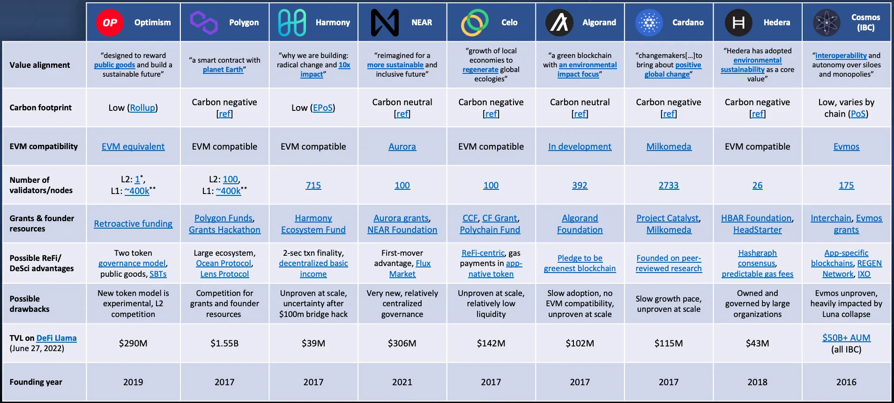

import imageBrettCornick from '@/images/brett-portrait-with-background.jpg'

export const article = {
  date: '2022-07-11',
  title:
    'Picking the best blockchain ecosystem for regenerative platform design',
  description:
    'What makes an attractive chain to build on for a regenerative future?',
  author: {
    name: 'Brett Cornick',
    role: 'Blog post',
    image: { src: imageBrettCornick },
  },
}

export const metadata = {
  title: article.title,
  description: article.description,
}

They say <a href="https://decrypt.co/101118/bear-markets-are-for-building-the-metaverse" target='_blank' rel='noreferrer'>bear markets are for builders</a>. I generally agree, though I doubt that the developers building on Terra/Luna six months ago would claim that this bear market has been good for them. Clearly, blockchain ecosystem selection is one of the most critical design decisions that an early-stage project must make to ensure the future success of their products, but many comparative guides on the subject are <a href="https://www.theblockresearch.com/development-comparison-between-layer-1-blockchains-108166" target='_blank' rel='noreferrer'>locked behind paywalls</a>. More specifically, <a href="https://newsletter.banklesshq.com/p/how-crypto-is-regenerating-the-world" target='_blank' rel='noreferrer'>regenerative finance</a> (#ReFi) and <a href="https://future.com/what-is-decentralized-science-aka-desci/" target='_blank' rel='noreferrer'>decentralized science</a> (#DeSci) projects have a unique set of needs, and since they are such nascent spaces there&apos;s not much clear guidance at all on where to start building. Recently, I&apos;ve asked Twitter what they think on the subject:

<EmbeddedTweet tweetID="1539891131923591169" />
<EmbeddedTweet tweetID="1544422137737252865" />

I&apos;ve decided to take this one step further and publish the results of my analysis here. It&apos;s important to note that since every project is unique, this guide is not meant to arrive at any concrete conclusions, but instead spur the conversation and set founders in the right direction to make their own informed decisions. <strong>This guide is also not exhaustive</strong> — there are so many blockchain ecosystems and design variables that such a guide would be nearly impossible to create, soon becoming outdated as the space rapidly evolves. I&apos;ve focused my evaluations on ecosystems that have clearly emphasized sustainability and/or public goods in their mission statements, with a preference for EVM compatibility. Also, note that the proof-of-work Ethereum L1 is omitted, in favor of Ethereum L2&apos;s that boast lower carbon footprints. This analysis will probably have to be revisited after <a href="https://ethereum.org/en/upgrades/merge/" target='_blank' rel='noreferrer'>the merge</a>.

Here is <a href="https://miro.medium.com/v2/resize:fit:4800/format:webp/1*0WCnQgn5kSwbFS4p0K07Ag.png" target="_blank" rel="noreferrer">the comparative table</a> that I produced during my analysis. Each ecosystem (Optimism, Polygon, etc.) is assessed across a standard set of evaluation metricssuch as value alignment and EVM compatibility. Further below you will find brief descriptions for each evaluation metric and some notes for further exploration. If you think that anything I&apos;ve presented is incorrect (there is an incredible amountof conflicting information out there) or you believe that I&apos;ve made an egregious omission, leave a comment saying, “Why didn&apos;t you include \[your favorite blockchain\]?!?” and I&apos;d be happy to update the graphic.

## Evaluation metrics

### Value alignment

Especially important for ReFi and DeSci projects is the general mission statement of the blockchain ecosystem. A mission statement that aligns with the goals of your platform can be a powerful tool for attracting complementary projects and potential collaborators. Each entry in this field was pulled directly from official ecosystem documentation and demonstrates at least some alignment with values of sustainability.

Sources: <a href="https://app.optimism.io/governance" target='_blank' rel='noreferrer'>Optimism</a>, <a href="https://polygon.technology/sustainability/" target='_blank' rel='noreferrer'>Polygon</a>, <a href="https://open.harmony.one/harmony-in-2026-scaling-web3-via-zkp-dao" target='_blank' rel='noreferrer'>Harmony</a>, <a href="https://near.org/" target='_blank' rel='noreferrer'>NEAR</a>, <a href="https://celo.org/" target='_blank' rel='noreferrer'>Celo</a>, <a href="https://www.algorand.com/about/sustainability" target='_blank' rel='noreferrer'>Algorand</a>, <a href="https://cardano.org/" target='_blank' rel='noreferrer'>Cardano</a>, <a href="https://hedera.com/carbon-offsets" target='_blank' rel='noreferrer'>Hedera</a>, <a href="https://cosmos.network/intro/" target='_blank' rel='noreferrer'>Cosmos</a>.

### Carbon footprint

Any project focused on regenerative and sustainable systems should maintain high regard for the carbon footprint of the chain they are building on. This consideration led me to omit any proof-of-work chains (like Bitcoin or pre-merge Ethereum) and focus on chains that have clearly demonstrated a commitment to green operations. As you can see from the table, many chains have pledged to be carbon neutral or even carbon negative.

Sources: <a href="https://ethereum.org/en/developers/docs/scaling/optimistic-rollups/" target='_blank' rel='noreferrer'>Optimism</a>, <a href="https://polygon.technology/sustainability/" target='_blank' rel='noreferrer'>Polygon</a>, <a href="https://blog.harmony.one/introducing-harmonys-effective-proof-of-stake-epos/" target='_blank' rel='noreferrer'>Harmony</a>, <a href="https://near.org/blog/near-climate-neutral-product/" target='_blank' rel='noreferrer'>NEAR</a>, <a href="https://celo.org/" target='_blank' rel='noreferrer'>Celo</a>, <a href="https://www.algorand.com/about/sustainability" target='_blank' rel='noreferrer'>Algorand</a>, <a href="https://cardanofoundation.org/en/news/how-green-can-the-cardano-community-make-cardanos-blockchain/" target='_blank' rel='noreferrer'>Cardano</a>, <a href="https://hedera.com/carbon-offsets" target='_blank' rel='noreferrer'>Hedera</a>, <a href="https://blog.cosmos.network/why-blockchains-need-cosmos-proof-of-stake-for-a-sustainable-environment-878b3edd2e85" target='_blank' rel='noreferrer'>Cosmos</a>.

### EVM compatibility

Some builders will disagree on the importance of EVM compatibility, but I personally give it high value to promote composability and enable easier future deployments on other chains. Many non-EVM compatible chains have recently been introducing EVM compatibility through side chains (like Aurora or Milkomeda) or transpilers (like <a href="https://github.com/NethermindEth/warp" target='_blank' rel='noreferrer'>Warp</a> on StarkNet). Interestingly, Optimism has recently promoted <a href="https://newsletter.banklesshq.com/p/evm-equivalence?s=r" target='_blank' rel='noreferrer'>EVM <em>equivalence</em></a>, which takes EVM compatibility one step further (the technical details of which are better explained <a href="https://newsletter.banklesshq.com/p/evm-equivalence?s=r" target='_blank' rel='noreferrer'>here</a>>.

Sources: <a href="https://newsletter.banklesshq.com/p/evm-equivalence?s=r" target='_blank' rel='noreferrer'>Optimism</a>, <a href="https://aurora.dev/" target='_blank' rel='noreferrer'>NEAR</a>, <a href="https://algorand.foundation/news/10-million-evm-compatibility-grant" target='_blank' rel='noreferrer'>Algorand</a>, <a href="https://www.milkomeda.com/" target='_blank' rel='noreferrer'>Cardano</a>, <a href="https://hedera.com/blog/hedera-hashgraph-announces-mainnet-launch-of-evm-compatible-smart-contracts-2-0" target='_blank' rel='noreferrer'>Hedera</a>, <a href="https://evmos.org/" target='_blank' rel='noreferrer'>Cosmos</a>.

### Number of validators/nodes

Ok, this gets a little messy but it&apos;s important. I&apos;m including this metric as a quantitative way to measure the decentralization of the ecosystem. Decentralization and the community governance that it enables is one of the main value propositions of blockchain for ReFi and DeSci projects, so I weight this metric pretty heavily. Unfortunately, there are too many nuances with the way that each chain handles consensus to neatly display the full picture in table format. I suggest using this as a starting point for a more detailed exploration, which should include how consensus is achieved, requirements for becoming a validator, and ecosystem roadmaps for further decentralization.

#### Notes:

\*Optimism&apos;s single “validator” actually refers to its single block producer, which is currently run by OP Labs PBC.
\*\*The number of <a href="https://beaconscan.com/" target='_blank' rel='noreferrer'>Ethereum validators</a> is based on the number of validators on the Beacon Chain, which is representative of the number of validators post-merge. The number of nodes on the current PoW Mainnet is <a href="https://etherscan.io/nodetracker#" target='_blank' rel='noreferrer'>much less</a>.

Sources: <a href="https://community.optimism.io/docs/how-optimism-works/#block-production" target='_blank' rel='noreferrer'>Optimism</a>, <a href="https://blog.polygon.technology/how-3-9-billion-of-staked-matic-keeps-polygon-secure/" target='_blank' rel='noreferrer'>Polygon</a>, <a href="https://harmony.smartstake.io/stats" target='_blank' rel='noreferrer'>Harmony</a>, <a href="https://near.org/decentralize/" target='_blank' rel='noreferrer'>NEAR</a>, <a href="https://celo.org/validators/explore" target='_blank' rel='noreferrer'>Celo</a>, <a href="https://metrics.algorand.org/#/decentralization/" target='_blank' rel='noreferrer'>Algorand</a>, <a href="https://cexplorer.io/pool" target='_blank' rel='noreferrer'>Cardano</a>, <a href="https://hashscan.io/#/mainnet/nodes" target='_blank' rel='noreferrer'>Hedera</a>, <a href="https://www.mintscan.io/cosmos/validators" target='_blank' rel='noreferrer'>Cosmos</a>.

### Grants & founder resources

An especially important consideration for projects that are trying to bootstrap, the availability of founder resources can make or break some early-stage teams. Most chains have a decent amount of grants, funding sources, accelerators programs, competitions, etc. to support projects at various stages of development. The comparison table lists just a few of these for each ecosystem, though there are certainly more.

Sources: <a href="https://medium.com/ethereum-optimism/retroactive-public-goods-funding-33c9b7d00f0c" target='_blank' rel='noreferrer'>Optimism</a>, Polygon(<a href="https://polygon.technology/funds/" target='_blank' rel='noreferrer'>1</a>,<a href="https://www.polygongrantshackathon.com/" target='_blank' rel='noreferrer'>2</a>), <a href="https://harmonyone.notion.site/300M-on-Web3-Grants-DAOs-4855479bb57b47d28cd5619df7af4ca7" target='_blank' rel='noreferrer'>Harmony</a>, NEAR(<a href="https://aurora.dev/grants" target='_blank' rel='noreferrer'>1</a>,<a href="https://near.org/grants/" target='_blank' rel='noreferrer'>2</a>), Celo(<a href="https://celocommunityfund.org/#grants-process" target='_blank' rel='noreferrer'>1</a>,<a href="https://celo.org/experience/grants/application-process#eligibility" target='_blank' rel='noreferrer'>2</a>,<a href="https://celo.org/community#fund" target='_blank' rel='noreferrer'>3</a>), <a href="https://algorand.foundation/grants-program" target='_blank' rel='noreferrer'>Algorand</a>, Cardano(<a href="https://developers.cardano.org/docs/governance/project-catalyst/" target='_blank' rel='noreferrer'>1</a>,<a href="https://www.milkomeda.com/accelerator" target='_blank' rel='noreferrer'>2</a>), Hedera(<a href="https://hedera.com/grants" target='_blank' rel='noreferrer'>1</a>,<a href="https://headstarter.org/" target='_blank' rel='noreferrer'>2</a>), Cosmos(<a href="https://evmos.blog/announcing-evmos-grants-78aa28562db6" target='_blank' rel='noreferrer'>1</a>,<a href="https://interchain.io/" target='_blank' rel='noreferrer'>2</a>).

### Possible ReFi/DeSci advantages

This is a bit of a mixed bag and varies depending on your project needs. Does your project need access to a large data marketplace or a decentralized social graph? Maybe you should explore Polygon. Do you want the freedom to design and build your own blockchain that&apos;s dedicated to your platform? Take a look at Cosmos. Are you a fully fledged regen looking for clear value alignment? Celo might be right for you.

Sources: Optimism(<a href="https://app.optimism.io/governance" target='_blank' rel='noreferrer'>1</a>,<a href="https://members.delphidigital.io/reports/glass-half-full-on-optimism/" target='_blank' rel='noreferrer'>2</a>), Polygon(<a href="https://blog.oceanprotocol.com/ocean-on-polygon-network-8abad19cbf47" target='_blank' rel='noreferrer'>1</a>,<a href="https://mirror.xyz/lensprotocol.eth" target='_blank' rel='noreferrer'>2</a>), <a href="https://arxiv.org/pdf/2107.14312.pdf" target='_blank' rel='noreferrer'>Harmony</a>, <a href="https://near.org/case-studies/flux/" target='_blank' rel='noreferrer'>NEAR</a>, Celo(<a href="https://forum.celo.org/t/celo-and-regenerative-finance/1447" target='_blank' rel='noreferrer'>1</a>,<a href="https://docs.celo.org/celo-codebase/protocol/transactions/erc20-transaction-fees" target='_blank' rel='noreferrer'>2</a>), <a href="https://www.algorand.com/resources/algorand-announcements/carbon_negative_announcement" target='_blank' rel='noreferrer'>Algorand</a>, <a href="https://decrypt.co/resources/cardano" target='_blank' rel='noreferrer'>Cardano</a>, Hedera(<a href="https://hedera.com/how-it-works" target='_blank' rel='noreferrer'>1</a>,<a href="https://hedera.com/fees" target='_blank' rel='noreferrer'>2</a>), Cosmos(<a href="https://docs.cosmos.network/master/intro/overview.html" target='_blank' rel='noreferrer'>1</a>,<a href="https://www.regen.network/" target='_blank' rel='noreferrer'>2</a>,<a href="https://www.ixo.world/" target='_blank' rel='noreferrer'>3</a>).

### Possible drawbacks

Unsurprisingly, the official documentation for each blockchain ecosystem doesn&apos;t clearly layout their shortcomings, so this is a bit more of a subjective evaluation by me pulled from unofficial sources — so take it with a grain of salt. A notable entry here is the recent <a href="https://cointelegraph.com/news/breaking-harmony-one-s-horizon-bridge-hacked-for-100m" target='_blank' rel='noreferrer'>$100m bridge hack</a> on Harmony, which casts some uncertainty on the future of the ecosystem.

Sources: myself 🤷🏻‍♂️

### Total value locked (TVL)

Not an incredibly important statistic considering that the entire crypto market cap is down nearly 70% from all time high. This can be useful for a quick evaluation of the relative size of each ecosystem, but more important is the general trend compared to the overall market. Additionally, the chains with higher TVL have likely endured more stress testing at scale.

Sources: All values from <a href="https://defillama.com/chains" target='_blank' rel='noreferrer'>DeFi Llama</a> on June 27, 2022, with the exception of <a href="https://cosmos.network/" target='_blank' rel='noreferrer'>Cosmos</a>.

### Founding year

Again, not a metric to be weighted too heavily. Newer blockchains might allow builders to capture a first-mover advantage, while older blockchains (pre-2018) have demonstrated that they can survive a bear market.

## Further considerations

### Complementary projects:

If your project could benefit greatly from various partnerships, you should have an understanding of where those potential partners are building.

### Cross-chain compatibility:

With the continued development of cross-chain bridges and protocols focused on blockchain interconnectivity, communication between ecosystems is becoming increasingly easier. Bridges are still one of the <a href="https://thedefiant.io/hackers-target-blockchain-bridges/" target='_blank' rel='noreferrer'>main targets for hackers</a>, but as the technology develops, this interconnectivity may effect the relative importance of some of these evaluation metrics.

### Exclusions:

Solana, Avalanche, Polkadot, Arbitrum L2, Fantom, Binance Smart Chain and plenty of others were not included in this evaluation. I decided to focus my evaluations on ecosystems that have clearly emphasized sustainability and/or public goods in their documentation, with a preference for EVM compatibility. This does not mean that other chains are not a potentially viable option for your project.

I hope this guide has been a helpful starting point for further research. I invite anyone to comment or message me their thoughts and feedback so that I can ensure my content is accurate.

---

I conducted this research as part of my work building out our own DeSci platform. <a href="https://intheory.science" target='_blank' rel='noreferrer'>Check it out here</a> if you&apos;re interested in learning more!

_Disclaimer: none of this is investment advice._\
_This article was originally <a href="https://medium.com/impact-finance/picking-the-best-blockchain-ecosystem-for-regenerative-finance-4846384acea3" target="_blank" rel="noreferrer">posted on Medium</a>._
