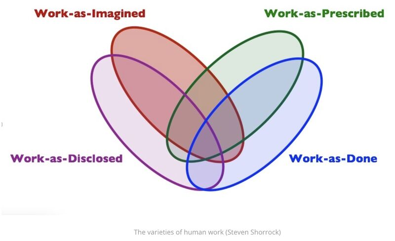

import imageBrettCornick from '@/images/brett-portrait-with-background.jpg'

export const article = {
  date: '2023-09-25',
  title: 'Shorrock Varieties of Human Work',
  description: 'Week 1 of post series, "My Favorite Thing I Learned Last Week"',
  author: {
    name: 'Brett Cornick',
    role: 'Short-form',
    image: { src: imageBrettCornick },
  },
}

export const metadata = {
  title: article.title,
  description: article.description,
}

### Week 1 of post series, "My Favorite Thing I Learned Last Week"

In an effort to better understand and improve human work, Shorrock varieties add much needed nuance to the way we define and discuss the work that we do.

By breaking work into the following 4 sub-categories, leaders can gain a more comprehensive understanding of how their teams perceive, communicate, and accomplish their tasks.

### 🤔 Work-as-Imagined:

How people envision work, which can vary widely and be influenced by different factors. These imaginations can shape how work is designed and understood, but they often differ from the reality of how work is actually done.

### 📝 Work-as-Prescribed:

The formal way we're supposed to do our jobs, but it often has limitations and may not fully capture the complexity of real work situations.

### 💬 Work-as-Disclosed:

How we describe our work, and it can vary depending on the situation and our audience. It may not always align with prescribed or imagined work and can be influenced by potential consequences and cultural factors.

### ✅ Work-as-Done:

The real-world work that people perform, which is often complex and doesn't always align with prescribed or imagined work. Understanding and bridging these gaps is crucial for improving systems and ensuring mental health and well-being.

Identifying where these varieties of work overlap and how they differ can help team leaders to set clear expectations, build team trust, and respond to failures.

Read more [here](https://humanisticsystems.com/2016/12/05/the-varieties-of-human-work/).

P.S. I'll be doing similar posts to this every week throughout my Venture Science Doctorate program. Let me know what you liked/didn't like!
